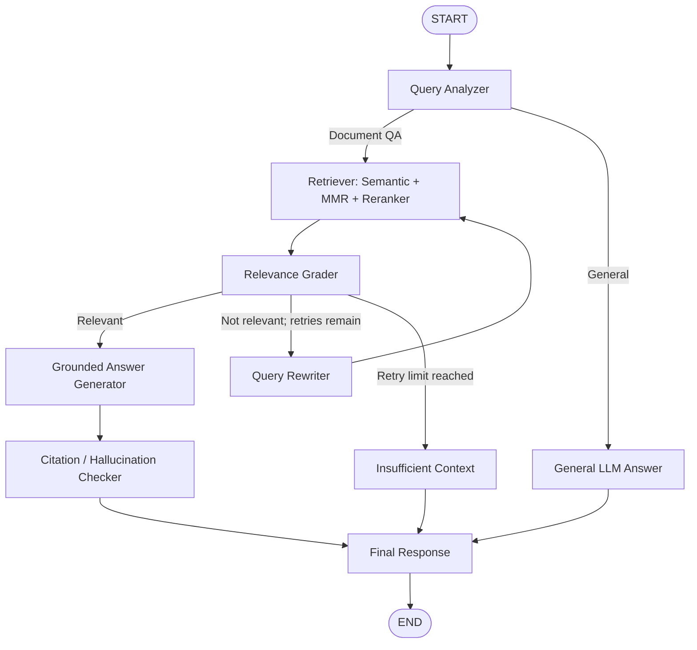

# LangGraph Agentic Workflow

The workflow is implemented with a real `langgraph.graph.StateGraph` and conditional edges. Retrieval reuses the Phase 3 `RetrievalService`; it is not duplicated inside the graph.
